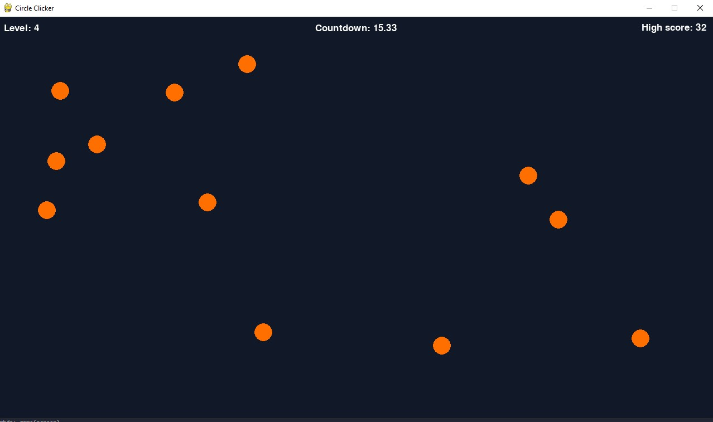

## Circle Clicker

Made by Nico01 for ICS 2O1 final assignment.

## About this project

This project was made with python and uses the pygame library. The game it self is simple, there are 10 levels with circles, the goal is to click all the circles before the timer runs out. As you move through the levels, the time to click the circles gets shorter, the amount of circles increases and the circles become harder to click.

## Screenhots

## MIT Licence

Copyright (c) 2022 nic01
